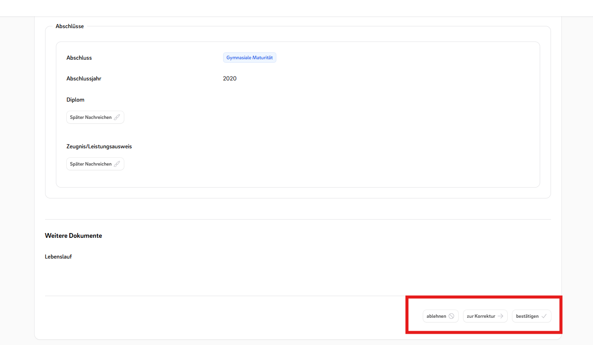

# Approvals Overview

This package allows you to easily implement approval workflows in your **Filament-powered** Laravel application. You can
define approval logic per model, specify who can approve (based on roles, permissions, or user logic), and expose
powerful UI actions using Filament’s `Infolist` components.

[](https://packagist.org/packages/ffhs/filament-package-ffhs_approvals)
[](https://packagist.org/packages/ffhs/filament-package-ffhs_approvals)

## Features:

- ✅ Native PHP Enums for status handling
- 🔁 Define multiple approval flows per model
- 👥 Role-, user-, and permission-based approval logic
- 🧩 Seamless integration with Filament Actions and Forms
- 🎨 Customize icons, labels, tooltips, colors per status
- 🛡️ Control button visibility and approval flow states based on business logic
- 🔔 Built-in confirmation prompts and notifications
- 🧱 Fully expandable

## Screenshoots



## Installation

You can install the package via composer:

```bash  
composer require ffhs/filament-package_ffhs_approvals  
```  

You can publish the config file with:

```bash  
php artisan vendor:publish --tag="filament-package_ffhs_approvals-config"  
```

You can publish and run the migrations with:

```bash  
php artisan vendor:publish --tag="filament-package_ffhs_approvals-migrations"  
php artisan migrate  
```

## Usage

### 1. Define Approval Status Enum

Create a PHP Enum implementing `HasApprovalStatuses`:

```php
use Ffhs\Approvals\Contracts\HasApprovalStatuses;  
  
enum MyApprovalStatus: string  implements HasApprovalStatuses  
{  
    case APPROVED = 'approved';  
    case INCOMPLETE = 'incomplete';  
    case DENIED = 'denied';  
  
    public static function getApprovedStatuses(): array  
    {  
        return [self::APPROVED];  
    }  
  
    public static function getDeniedStatuses(): array  
    {  
        return [self::DENIED];  
    }  
  
    public static function getPendingStatuses(): array  
    {  
        return [self::INCOMPLETE];  
    }  
}
```

---

### 2. Define Approval Flow in Model

Implement `Approvable` and use the `HasApprovals` trait:

```php
namespace App\Models;

class MyModel extends Model implements Approvable{
	use HasApprovals;

	public function getApprovalFlows(): array  
	{
		return [
			'managment_aproved' => SimpleApprovalFlow::make()
				->category('any_catergory');  
				->approvalStatus(ApplicationApprovalStatus::cases())
				->aprovalBy([
					SimpleApprovalBy::make('employee')
						->any(),
						
					SimpleApprovalBy::make('manager')
						->permission('can_approve_for_manager'),
						
					SimpleApprovalBy::make('hr')
						->role('hr_role')
						->atLeast(2)
					
				])
		];
	}
}
```

---

### 3. Basic Filament Action Usage

Render the approval action in your Filament resource or view:

```php
// MyModelView.php

ApprovalActions::make('managment_aproved')
```

---

### 4. Advanced Configuration

Customize your Filament Action appearance and logic:

```php
// MyModelView.php
ApprovalActions::make('managment_aproved')
    ->requiresConfirmation()
    ->needResetApprovalBeforeChange()
    ->size(ActionSize::ExtraSmall)
    ->alignRight()
    ->groupLabels([
        'employee' => 'Any',
        'manager' => 'Manager',
        'hr' => 'HR',
    ])
    ->casesIcons([
        MyApprovalStatus::APPROVED->value => 'heroicon-m-check',
        MyApprovalStatus::INCOMPLETE->value => 'heroicon-o-arrow-right',
        MyApprovalStatus::DENIED->value => 'heroicon-m-no-symbol',
    ])
    ->casesSelectedColors([
        MyApprovalStatus::APPROVED->value => Color::Green,
        MyApprovalStatus::INCOMPLETE->value => Color::Orange,
        MyApprovalStatus::DENIED->value => Color::Red,
    ])
    ->casesToolTips([
        MyApprovalStatus::APPROVED->value => 'This section has been approved for validation.',
        MyApprovalStatus::INCOMPLETE->value => 'This section has been returned for revision.',
        MyApprovalStatus::DENIED->value => 'This section has been rejected, which also rejects the application.',
    ])
    ->notificationOnResetApproval('The approval status for this section has been reset.')
    ->notificationOnSetApproval(fn($status) => match ($status) {
        MyApprovalStatus::APPROVED->value => 'This section has been approved.',
        MyApprovalStatus::INCOMPLETE->value => 'This section has been returned for revision.',
        MyApprovalStatus::DENIED->value => 'This section has been rejected.',
    })
    ->casesDisabled(fn(MyModel $record) => [
        MyApprovalStatus::INCOMPLETE->value => $record->state::class !== Received::class,
    ])
    ->disabled(function (MyModel $record) {
        return match ($record->state::class) {
            Open::class,
            PaymentFailed::class,
            Aborted::class,
            Rejected::class,
            Withdrawn::class,
            WithdrawnAfterEnrolled::class => true,
            default => false,
        };
    });
```

## Testing

```bash  
composer install  
./vendor/bin/testbench vendor:publish --tag="filament-package_ffhs_custom_forms-migrations"    
./vendor/bin/testbench workbench:build  
./vendor/bin/pest test    
```

## Changelog

Please see [CHANGELOG](CHANGELOG.md) for more information on what has changed recently.

## Credits

- [Kirschbaum Development Group](https://github.com/kirschbaum-development)

## License

The MIT License (MIT). Please see [License File](LICENSE.md) for more information.
