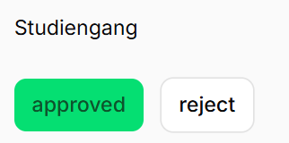
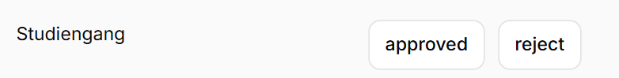
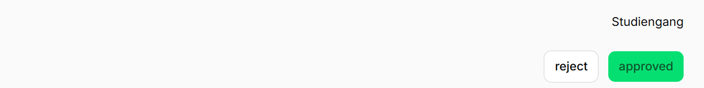
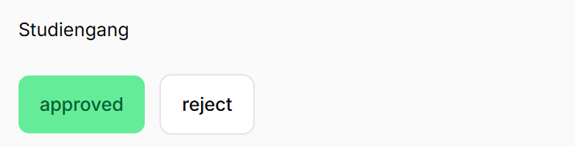
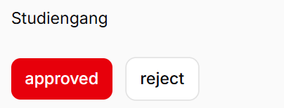
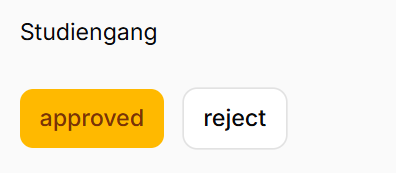

# Style Customization

## Default

By default, the ApprovalAction looks like this:

```php
ApprovalActions::make('sgs_module_plan')
```



## Case Methods

There are two methods to configure settings for each case:

1. **Individual case method**: `...case($case, Closure|... $value)` - Takes a case and a closure that sets the settings
   for this specific case.
2. **Bulk case method**: `...cases(Closure|array $values)` - Takes an array where the case value is defined as the key
   and referenced to the corresponding value. The value can also be a closure.

## ApprovalBy Labels

You can customize the labels for the ApprovalBy fields:

```php
ApprovalActions::make('sgs_module_plan')
    ->approvalByLabel('manager', 'Manager')
    ->approvalByLabels([
        'manager' => 'Manager',
        'supervisor' => 'Supervisor',
        'director' => 'Director',
    ])
```

## Hidde Case

You can hide specific cases conditionally using the `caseHidden()` method:

```php
ApprovalActions::make('sgs_module_plan')
    ->caseHidden(SGApprovalStatus::APPROVED, fn() => !auth()->user()->can('view_approval'))
    ->casesHidden([
        SGApprovalStatus::APPROVED => fn() => !auth()->user()->can('view_approval'),
        SGApprovalStatus::DENIED => true,
    ])
```

## Case Label

You can customize the label displayed for each case:

```php
ApprovalActions::make('sgs_module_plan')
    ->caseLabel(SGApprovalStatus::APPROVED, 'Approve Request')
    ->caseLabels([
        SGApprovalStatus::APPROVED => 'Approve Request',
        SGApprovalStatus::DENIED => 'Reject Request',
        SGApprovalStatus::PENDING => 'Mark as Pending',
    ])
```

### Inline

The label of the ApprovalBy can be displayed inline.

```php
ApprovalActions::make('sgs_module_plan')
    ->inlineLabel()
```



## Size and Positioning

### fullWidth

When full width is enabled, the action fills the entire width of the ApprovalAction component.

```php
ApprovalActions::make('sgs_module_plan')
    ->fullWidth()
```


### Alignment

Alignment can be set to left, right, or center.

```php
ApprovalActions::make('sgs_module_plan')
    ->alignLeft()
    ->alignCenter()
    ->alignRight()
```



### Size

The size method allows you to adjust the size of the actions.

```php
ApprovalActions::make('sgs_module_plan')
    ->size(Size::ExtraLarge)
```



## Colors

By default, all actions are white. When an action is selected, the color of the corresponding ApprovalState is
displayed (not the case color - cases are the enum values).

### Custom Approval State Colors (Not Case Colors)

Custom approval state colors can be configured using the following methods:

```php
ApprovalActions::make('sgs_module_plan')
    ->approvalStatusColors([
        ApprovalState::APPROVED->value => 'success',
        ApprovalState::DENIED->value => 'danger',
        ApprovalState::PENDING->value => 'info',
        ApprovalState::OPEN->value => 'white',
    ])
    ->approvalStateColor(ApprovalState::APPROVED, 'danger')
    ->approvalStateColor(ApprovalState::DENIED, 'warning')
    ->approvalStateColor(ApprovalState::PENDING, 'success')
```



### Custom Color for Cases

When you want to change the color of specific cases, you can use the color methods. For example, if you have two
approval states like "approved" and "approved-but" and want to customize their color appearance, you can differentiate
between selected and unselected colors:

```php
ApprovalActions::make('sgs_module_plan')
    ->caseColor(SGApprovalStatus::APPROVED, 'warning')
    ->caseSelectedColor(SGApprovalStatus::APPROVED, 'white')
```



## Notifications

Notifications can be configured for the following actions: set approval, reset approval, remove approval, or change
approval. Each case can have its own notification, except for the reset action.

The notification can be:

- `null` - No notification will be sent
- A `string` or a `Closure` that returns a string
- A `Notification` object or a `Closure` that returns a Notification object

Available methods:

- `casesNotificationOnRemoveApproval`
- `casesNotificationOnSetApproval`
- `casesNotificationOnChangeApproval`
- `notificationOnResetApproval`

## Disable Case

You can disable specific cases conditionally using the `caseDisabled()` method:

```php
ApprovalActions::make('sgs_module_plan')
    ->caseDisabled(SGApprovalStatus::APPROVED, fn() => !auth()->user()->can('approve'))
    ->casesDisabled([
        SGApprovalStatus::APPROVED => fn() => !auth()->user()->can('approve'),
        SGApprovalStatus::DENIED => false,
    ])
```

## Case Icon

You can customize the icon displayed for each case:

```php
ApprovalActions::make('sgs_module_plan')
    ->caseIcon(SGApprovalStatus::APPROVED, '....')
```
